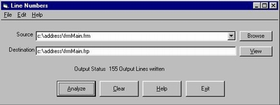



## Add line numbers to your code

### Description

This program adds line numbers to your VB code. I

teach VB programming and needed a way to reference

the code by a line number for creating quizzes.
 
### More Info
 
User has to specify the csource file and

destination file.

             |
---                |---
**Submitted On**   |2002-12-30 07:00:26
**By**             |[John Krytus](https://github.com/Planet-Source-Code/PSCIndex/blob/master/ByAuthor/john-krytus.md)
**Level**          |Intermediate
**User Rating**    |3.0 (9 globes from 3 users)
**Compatibility**  |VB 6\.0
**Category**       |[Files/ File Controls/ Input/ Output](https://github.com/Planet-Source-Code/PSCIndex/blob/master/ByCategory/files-file-controls-input-output__1-3.md)
**World**          |[Visual Basic](https://github.com/Planet-Source-Code/PSCIndex/blob/master/ByWorld/visual-basic.md)
**Archive File**   |[Add\_line\_n15205312302002\.zip](https://github.com/Planet-Source-Code/john-krytus-add-line-numbers-to-your-code__1-41964/archive/master.zip)

